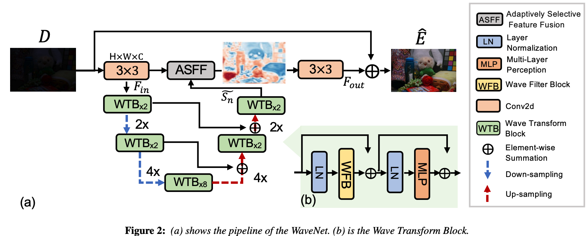
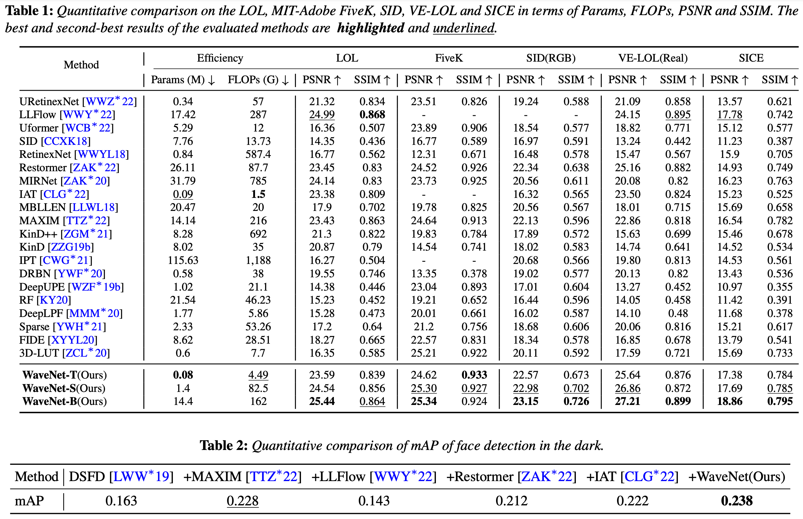

# [PG 2023] [WaveNet: Wave-Aware Image Enhancement](https://diglib.eg.org/bitstream/handle/10.2312/pg20231267/021-029.pdf)  

## [Jiachen Dang](https://github.com/DenijsonC), Zehao Li, Yong Zhong, [Lishun Wang](https://github.com/ucaswangls)   
[](https://diglib.eg.org/bitstream/handle/10.2312/pg20231267/021-029.pdf) 

> As a low-level vision task, image enhancement is widely used in various computer vision applications. Recently, multiple methods combined with CNNs, MLP, Transformer, and the Fourier transform have achieved promising results on image enhancement tasks. However, these methods cannot achieve a balance between accuracy and computational cost. In this paper, we formulate the enhancement into a signal modulation problem and propose the WaveNet architecture, which performs well in various parameters and improves the feature expression using wave-like feature representation. Specifically, to better capture wave-like feature representations, we propose to represent a pixel as a sampled value of a signal function with three wave functions (Cosine Wave (CW), Sine Wave (SW), and Gating Wave (GW)) inspired by the Fourier transform. The amplitude and phase are required to generate the wave-like features. The amplitude term includes the original contents of features, and the phase term modulates the relationship between various inputs and fixed weights. To dynamically obtain the phase and the amplitude, we build the Wave Transform Block (WTB) that adaptively generates the waves and modulates the wave superposition mode. Based on the WTB, we establish an effective architecture WaveNet for image enhancement. Extensive experiments on six real-world datasets show that our model achieves better quantitative and qualitative results than state-of-the-art methods. 

## Network Architecture  
<table>
  <tr>
    <td colspan="2"> </td>  
  </tr>
  <tr>
    <td colspan="2"><p align="center"><b>Overall pipeline of WaveNet-B</b></p></td>
  </tr>
</table>

## Quick Run  

Test on local environment:  

To test the pre-trained models of enhancing on your own images, run
```
python demo.py --input_dir images_folder_path --result_dir save_images_here --weights path_to_models
```
**All pre-trained models can be found at the folder "checkpoints/$<$dataset$>$"

## Train  
The train code will be released soon! 
But you can train our model by writing a simple training script.
  
- Dataset:  
  The preparation of dataset in more detail, see [datasets/README.md](datasets/README.md).  

## Test (Evaluation)  
 
- To test the PSNR, SSIM and LPIPS of *image enhancement*, see [evaluation.py](./evaluation.py) and run
```
python evaluation.py -dirA images_folder_path -dirB images_folder_path -type image_data_type --use_gpu use_gpu_or_not
```

## Result  

- <details close>
  <summary><b>- Quantitative Evaluation on LOL/FiveK/VE-LOL/SID/SICE/DARK FACE datasets.</b></summary>

    
     


</details>  

- <details close>
  <summary><b>- Qualitative Evaluation on LOL/FiveK/VE-LOL/SID/SICE/DARK FACE datasets.</b></summary>

    


</details>  


## Citation  

```
@inproceedings {10.2312:pg.20231267,
booktitle = {Pacific Graphics Short Papers and Posters},
editor = {Chaine, Raphaëlle and Deng, Zhigang and Kim, Min H.},
title = {{WaveNet: Wave-Aware Image Enhancement}},
author = {Dang, Jiachen and Li, Zehao and Zhong, Yong and Wang, Lishun},
year = {2023},
publisher = {The Eurographics Association},
ISBN = {978-3-03868-234-9},
DOI = {10.2312/pg.20231267}
} 
```
## Contact
Should you have any question, please contact dj.chen112@gmail.com


**Acknowledgment:** This code is based on the [MIRNet](https://github.com/swz30/MIRNet). 
