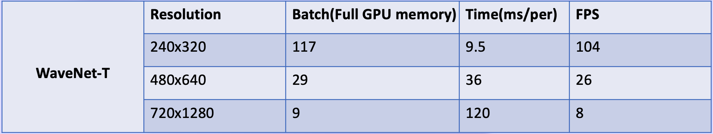

# [PG 2023] [WaveNet: Wave-Aware Image Enhancement](https://diglib.eg.org/bitstream/handle/10.2312/pg20231267/021-029.pdf)  

## [Jiachen Dang](https://github.com/DenijsonC), Zehao Li, Yong Zhong, [Lishun Wang](https://github.com/ucaswangls)   
[](https://diglib.eg.org/bitstream/handle/10.2312/pg20231267/021-029.pdf)
[](https://drive.google.com/file/d/1-GX0wVr3A8OXvUfSn1HwEIhvhnu7_3FT/view?usp=sharing)
#### News
- **11.09, 2023:** Training codes and logs have been released. Feel free to use them. 🚀
- **10 12, 2023:** Codes and pre-trained models are released! ⭐
- **09 15, 2023:** Our paper has been accepted by PG 2023. Code and Models will be released. 🎉
<hr />

> **Abstract:** * As a low-level vision task, image enhancement is widely used in various computer vision applications. Recently, multiple methods combined with CNNs, MLP, Transformer, and the Fourier transform have achieved promising results on image enhancement tasks. However, these methods cannot achieve a balance between accuracy and computational cost. In this paper, we formulate the enhancement into a signal modulation problem and propose the WaveNet architecture, which performs well in various parameters and improves the feature expression using wave-like feature representation. Specifically, to better capture wave-like feature representations, we propose to represent a pixel as a sampled value of a signal function with three wave functions (Cosine Wave (CW), Sine Wave (SW), and Gating Wave (GW)) inspired by the Fourier transform. The amplitude and phase are required to generate the wave-like features. The amplitude term includes the original contents of features, and the phase term modulates the relationship between various inputs and fixed weights. To dynamically obtain the phase and the amplitude, we build the Wave Transform Block (WTB) that adaptively generates the waves and modulates the wave superposition mode. Based on the WTB, we establish an effective architecture WaveNet for image enhancement. Extensive experiments on six real-world datasets show that our model achieves better quantitative and qualitative results than state-of-the-art methods. 
<hr />

<details close>
<summary><b>Pipeline</b></summary>


</details>

## Installation

See [INSTALL.md](INSTALL.md) for the installation of dependencies required to run WaveNet.

## Quick Run (Demo) 

Test on the local environment:  

To test the pre-trained models for enhancing your images, run
```
cd basicsr

python demo.py --input_dir images_folder_path --result_dir save_images_here --weights path_to_models
```
**All pre-trained models can be found in the folder "checkpoints/$<$dataset$>$"

## Train  
Training for Image Enhancement is provided in <a href="basicsr/TRAINING.md">TRAINING.md</a></td>. Here is a summary table containing hyperlinks for easy navigation:

<table>
  <tr>
    <th align="left">Model</th>
    <th align="center">LOL | log</th>
    <th align="center">FiveK | log</th>
    <th align="center">SID | log</th>
  </tr>
  <tr>
    <td align="left">WaveNet-B</td>
    <td align="center"><a href="checkpoints/LOL">weights | </a><a href="tb_logger/WaveNet_B_LOL">log</a></td>
    <td align="center"><a href="checkpoints/5k">weights | </a><a href="tb_logger/WaveNet_B_5k">log</a></td>
    <td align="center"><a href="checkpoints/SID">weights | </a><a href="tb_logger/WaveNet_B_sid">log</a></td>
  </tr>
  <tr>
    <td>WaveNet-S</td>
    <td align="center"><a href="checkpoints/LOL">weights | </a><a href="tb_logger/WaveNet_S_LOL">log</a></td>
    <td align="center"><a href="checkpoints/5k">weights | </a><a href="tb_logger/WaveNet_S_5k">log</a></td>
    <td align="center"><a href="checkpoints/SID">weights | </a><a href="tb_logger/WaveNet_S_sid">log</a></td>
  </tr>
  <tr>
    <td>WaveNet-T</td>
    <td align="center"><a href="checkpoints/LOL">weights | </a><a href="tb_logger/WaveNet_T_LOL">log</a></td>
    <td align="center"><a href="checkpoints/5k">weights | </a><a href="tb_logger/WaveNet_T_5k">log</a></td>
    <td align="center"><a href="checkpoints/SID">weights | </a><a href="tb_logger/WaveNet_T_sid">log</a></td>
  </tr>
</table>

## Dataset
For the preparation of dataset, see [datasets/README.md](datasets/README.md).  

## Test (Evaluation)  
 
- To test the PSNR, SSIM and LPIPS of *image enhancement*, see [evaluation.py](./evaluation.py) and run
```
cd basicsr

python evaluation.py -dirA images_folder_path -dirB images_folder_path -type image_data_type --use_gpu use_gpu_or_not
```

## Result  

<details close>
<summary><b>Quantitative Evaluation on LOL/FiveK/VE-LOL/SID/SICE/DARK FACE datasets.</b></summary>


 


</details>  

<details close>
<summary><b>Qualitative Evaluation on LOL/FiveK/VE-LOL/SID/SICE/DARK FACE datasets.</b></summary>


</details>  
<details close>
<summary><b>Efficiency (Tested on a single RTX 3090, Pytorch 1.11)</b></summary>




</details>  

## Citation  

```
@inproceedings {10.2312:pg.20231267,
booktitle = {Pacific Graphics Short Papers and Posters},
editor = {Chaine, Raphaëlle and Deng, Zhigang and Kim, Min H.},
title = {{WaveNet: Wave-Aware Image Enhancement}},
author = {Dang, Jiachen and Li, Zehao and Zhong, Yong and Wang, Lishun},
year = {2023},
publisher = {The Eurographics Association},
ISBN = {978-3-03868-234-9},
DOI = {10.2312/pg.20231267}
} 
```
## Contact
Should you have any questions, please contact dj.chen112@gmail.com


**Acknowledgment:** This code is based on the [BasicSR](https://github.com/xinntao/BasicSR) toolbox. 
